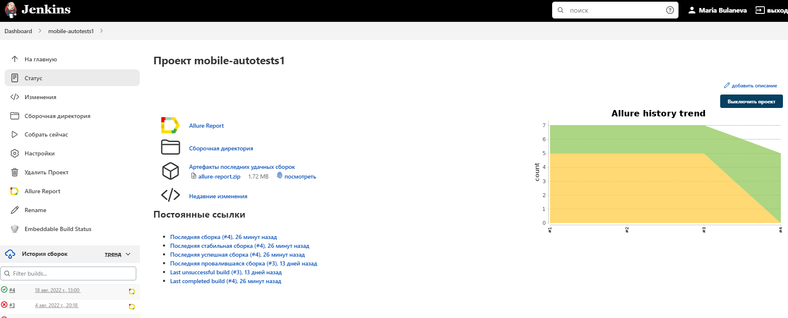
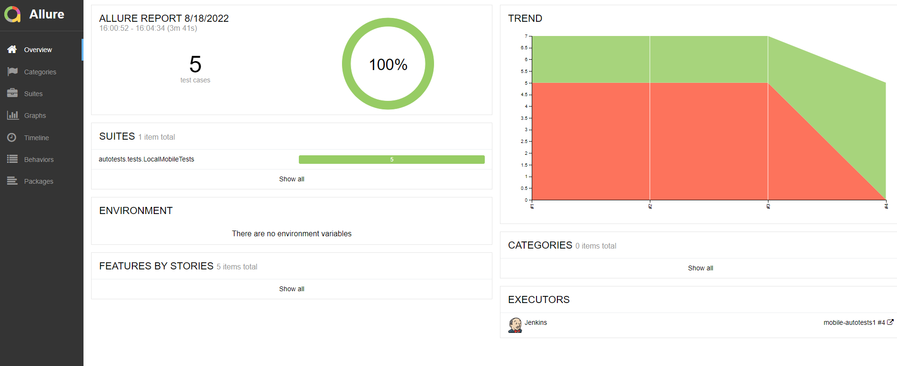
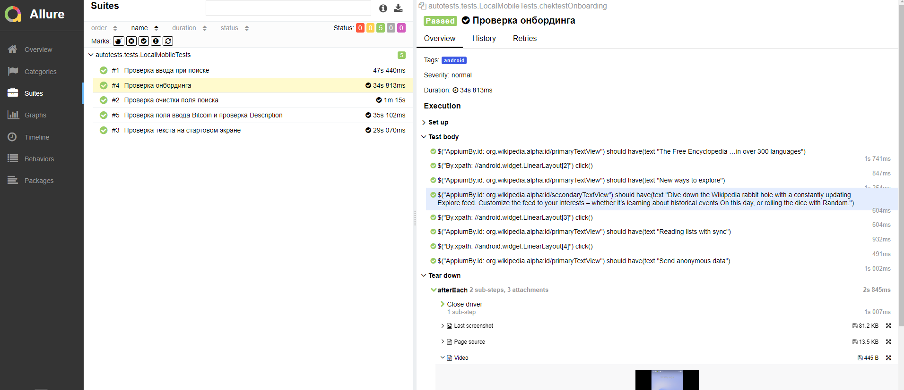

# :four_leaf_clover:Проект по автоматизации тестирования android-приложения  "Wikipedia":four_leaf_clover:
<a id="anchor"></a>
## <a target="_blank" href="https://www.wikipedia.org/">Сайт Wikipedia</a>


## :four_leaf_clover: Содержание:

- <a href="#four_leaf_clover-технологии-и-инструменты">Технологии и инструменты</a>
- <a href="#four_leaf_clover-реализованные-проверки">Реализованные проверки</a>
- <a href="#four_leaf_clover-сборка-в-Jenkins">Сборка в Jenkins</a>
- <a href="#four_leaf_clover-запуск-из-терминала">Запуск из терминала</a>
- <a href="#four_leaf_clover-allure-отчет">Allure отчет</a>
- <a href="#four_leaf_clover-видео-примеры-прохождения-тестов">Видео примеры прохождения тестов</a>


## :four_leaf_clover: Технологии и инструменты

<p align="center">


</p>

## :four_leaf_clover: Реализованные проверки
- [x] Проверка поля ввода appium
- [x] Проверка очистки поля поиска
- [x] Проверка поля ввода Bitcoin и проверка Description
- [x] Проверка онбординга
- [x] Проверка текста на стартовом экране


## :four_leaf_clover: Сборка в Jenkins
### <a target="_blank" href="https://jenkins.autotests.cloud/job/mobile-autotests1/">Сборка в Jenkins</a>
<p align="center">

</p>  

## :four_leaf_clover: Запуск из терминала
Локальный запуск:
```
gradle clean test -DdeviceHost=browserstack
```

Удаленный запуск:
```
clean
test
-DdeviceHost=browserstack
```

## :four_leaf_clover: Allure отчет
- ### Главный экран отчета
<p align="center">

</p>

- ### Страница с проведенными тестами
<p align="center">

</p>


## :four_leaf_clover: Видео примеры прохождения тестов
> К каждому тесту в отчете прилагается видео. Одно из таких видео представлено ниже.
<p align="center">
  

:arrow_up: [Вверх страницы](#anchor)

:heart: <a target="_blank" href="https://qa.guru">qa.guru</a><br/>
:blue_heart: <a target="_blank" href="https://t.me/qa_automation">t.me/qa_automation</a>
